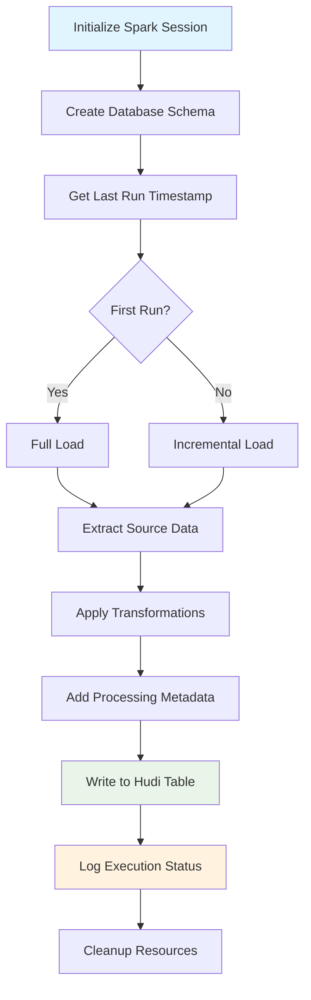

# PySpark Hudi ETL Pipeline Template

[](https://www.python.org/downloads/)
[](https://spark.apache.org/)
[](https://hudi.apache.org/)
[](LICENSE)

A production-ready PySpark ETL pipeline template designed for modern Lakehouse architectures using Apache Hudi and Hive Metastore. This template demonstrates enterprise-level data engineering practices with incremental processing, comprehensive logging, error handling, and monitoring capabilities.

## 🏗️ Architecture Overview

This pipeline implements a **Lakehouse architecture** that combines the best of data lakes and data warehouses:

```
┌─────────────────┐    ┌─────────────────┐    ┌─────────────────┐
│   Source Data   │    │   Processing    │    │  Target Tables  │
│                 │    │                 │    │                 │
│ • Raw Tables    │───▶│ • PySpark ETL   │───▶│ • Hudi Tables   │
│ • Event Streams │    │ • Incremental   │    │ • Hive Catalog  │
│ • APIs          │    │ • Transformers  │    │ • Analytics     │
└─────────────────┘    └─────────────────┘    └─────────────────┘
                              │
                              ▼
                       ┌─────────────────┐
                       │   Monitoring    │
                       │                 │
                       │ • Pipeline Logs │
                       │ • Status Track  │
                       │ • Error Handle  │
                       └─────────────────┘
```

### Key Components

- **Apache Spark**: Distributed data processing engine
- **Apache Hudi**: Transactional data lake storage format
- **Hive Metastore**: Centralized metadata catalog
- **Incremental Processing**: Delta load capabilities
- **Comprehensive Logging**: Pipeline execution tracking

## Features

### **Production-Ready**
- Comprehensive error handling and retry logic
- Resource management and cleanup
- Configurable for multiple environments (dev/staging/prod)
- Extensive logging with structured format

### **Performance Optimized**
- Adaptive query execution enabled
- Partition coalescing for optimal performance
- Snappy compression for storage efficiency
- Memory and storage fraction tuning

### **Incremental Processing**
- Change Data Capture (CDC) capabilities
- Timestamp-based incremental loads
- Idempotent pipeline execution
- Full and incremental load strategies

### **Monitoring & Observability**
- Pipeline execution logging
- Status tracking and reporting
- Processing time and record count metrics
- Error tracking with detailed messages

## Prerequisites

- Apache Spark 3.0+ with Hudi support
- Python 3.8+
- Hive Metastore configured
- HDFS or compatible storage system

## 🛠️ Installation & Setup

### 1. Environment Setup

```bash
# Clone the repository
git clone https://github.com/yourusername/spark-hudi-etl-pipeline.git
cd spark-hudi-etl-pipeline

# Set up Python environment
python -m venv venv
source venv/bin/activate  # On Windows: venv\Scripts\activate

# Install dependencies
pip install pyspark==3.4.0
```

### 2. Spark Configuration

Ensure your Spark environment includes Hudi dependencies:

```bash
# Example spark-submit command
spark-submit \
  --packages org.apache.hudi:hudi-spark3-bundle_2.12:0.12.0 \
  --conf 'spark.serializer=org.apache.spark.serializer.KryoSerializer' \
  --conf 'spark.sql.catalog.spark_catalog=org.apache.spark.sql.hudi.catalog.HoodieCatalog' \
  your_pipeline.py
```

## 📊 Pipeline Architecture Deep Dive

### Task Flow Architecture



### Core Components Breakdown

#### 1. **Session Management** (`get_spark_session()`)
```python
# Optimized Spark configuration for Lakehouse
spark = SparkSession.builder \
    .appName("DataPipeline") \
    .config("spark.sql.adaptive.enabled", "true") \
    .config("spark.sql.catalog.spark_catalog", 
            "org.apache.spark.sql.hudi.catalog.HoodieCatalog") \
    .getOrCreate()
```

#### 2. **Schema Management** (`create_database_and_table()`)
- **Hive Integration**: Seamless integration with Hive Metastore
- **Hudi Tables**: ACID transactions on data lake
- **Schema Evolution**: Support for table schema changes

#### 3. **Incremental Processing** (`get_last_run_timestamp()`)
```python
# Smart incremental loading
last_run_df = spark.sql("""
    SELECT current_run_timestamp 
    FROM metadata_layer.pipeline_log 
    WHERE pipeline_name = 'your_pipeline' 
    AND status = 'SUCCESS'
    ORDER BY current_run_timestamp DESC 
    LIMIT 1
""")
```

#### 4. **Data Processing Pipeline**
- **Extract**: Query source tables with optimal joins
- **Transform**: Business logic and data quality checks
- **Load**: Upsert to Hudi tables with conflict resolution

## Configuration & Customization

### Environment Configuration

```python
ENVIRONMENT_CONFIGS = {
    "development": {
        "database_name": "dev_analytics_layer",
        "pipeline_name": "dev_pipeline",
        "spark_configs": {
            "spark.sql.shuffle.partitions": "10"
        }
    },
    "production": {
        "database_name": "prod_analytics_layer", 
        "pipeline_name": "prod_pipeline",
        "spark_configs": {
            "spark.sql.shuffle.partitions": "200"
        }
    }
}
```

### Customizing for Your Use Case

#### 1. **Update Schema Definition**
```python
# Modify in create_database_and_table()
spark.sql(f"""
    CREATE TABLE IF NOT EXISTS {DATABASE_NAME}.your_table (
        id STRING,
        event_time TIMESTAMP,
        user_id STRING,
        -- Add your columns here
        processing_date DATE,
        load_timestamp TIMESTAMP
    )
    USING HUDI
    TBLPROPERTIES (
        type = 'cow',
        primaryKey = 'id',
        preCombineField = 'load_timestamp'
    )
""")
```

#### 2. **Implement Data Extraction Logic**
```python
def extract_source_data(spark, last_run_timestamp=None):
    base_query = """
    SELECT 
        -- Your column selections
    FROM your_source_table
    WHERE condition = 'value'
    """
    
    # Add incremental logic
    if last_run_timestamp:
        base_query += f"AND updated_at > {last_run_timestamp}"
    
    return spark.sql(base_query)
```

#### 3. **Add Business Logic Transformations**
```python
def process_data(df):
    return df \
        .withColumn("processed_field", your_transformation()) \
        .withColumn("processing_date", current_date()) \
        .withColumn("load_timestamp", current_timestamp())
```

## Usage Examples

### Basic Pipeline Execution

```python
from pipeline import daily_pipeline_run

# Simple execution with automatic session management
success = daily_pipeline_run()
if success:
    print("Pipeline completed successfully!")
```

### Advanced Session Management

```python
from pipeline import get_spark_session, run_pipeline, get_pipeline_status

# Manual session management for complex workflows
spark = get_spark_session()
try:
    # Run the pipeline
    records_processed = run_pipeline(spark)
    print(f"Processed {records_processed} records")
    
    # Check pipeline status
    get_pipeline_status(spark, days=7)
    
finally:
    spark.stop()
```

### Monitoring Pipeline Status

```python
# Check recent pipeline runs
get_pipeline_status(days=14)

# Output:
# +------------------+-------------------+-------------------+-------+
# |     pipeline_name|    last_run_time|  current_run_time| status|
# +------------------+-------------------+-------------------+-------+
# |data_pipeline     |2025-01-15 10:30:00|2025-01-15 10:32:15|SUCCESS|
```

## Performance Tuning

### Spark Configuration Best Practices

```python
# Memory optimization
.config("spark.memory.fraction", "0.8")
.config("spark.memory.storageFraction", "0.5")

# Adaptive query execution
.config("spark.sql.adaptive.enabled", "true")
.config("spark.sql.adaptive.coalescePartitions.enabled", "true")

# File handling optimization
.config("spark.sql.files.maxPartitionBytes", "256MB")
.config("spark.sql.adaptive.coalescePartitions.minPartitionSize", "64MB")
```

### Hudi Table Optimization

```python
# Configure for optimal performance
.option("hoodie.clean.automatic", "true")
.option("hoodie.metadata.enable", "false")  # For large tables
.option("hoodie.datasource.write.keygenerator.class", 
        "org.apache.hudi.keygen.NonpartitionedKeyGenerator")
```

## Monitoring & Alerting

### Pipeline Metrics

The pipeline tracks comprehensive metrics:

- **Execution Status**: SUCCESS/FAILED
- **Processing Time**: Duration in seconds
- **Records Processed**: Count of records
- **Error Messages**: Detailed error information
- **Timestamps**: Last run and current run times

### Example Monitoring Query

```sql
SELECT 
    pipeline_name,
    FROM_UNIXTIME(current_run_timestamp/1000) as run_time,
    status,
    records_processed,
    processing_time_seconds,
    error_message
FROM metadata_layer.pipeline_log
WHERE pipeline_name = 'your_pipeline'
ORDER BY current_run_timestamp DESC
LIMIT 10;
```

## Error Handling & Recovery

### Comprehensive Error Management

```python
try:
    # Pipeline execution
    records = run_pipeline()
    create_log_entry(spark, last_run_ts, current_run_ts, 
                     "SUCCESS", records, processing_time)
except Exception as e:
    # Log failure with details
    create_log_entry(spark, last_run_ts, current_run_ts, 
                     "FAILED", 0, processing_time, str(e))
    logger.error(f"Pipeline failed: {str(e)}")
    raise
```

### Recovery Strategies

1. **Idempotent Design**: Safe to rerun multiple times
2. **Incremental Processing**: Only process new data
3. **Detailed Logging**: Full error context for debugging
4. **Resource Cleanup**: Proper Spark session management

## Development Workflow

### Local Development

```bash
# Set environment
export ENVIRONMENT=development

# Run pipeline locally
python pipeline.py
```

### Testing with Sample Data

```python
# Generate test data
test_df = create_sample_data_for_testing(spark)

# Process test data
processed_df = process_data(test_df)
processed_df.show()
```

## Best Practices Demonstrated

### 1. **Lakehouse Architecture Patterns**
- **Unified Storage**: Single source of truth with ACID properties
- **Schema Management**: Centralized metadata with Hive
- **Performance**: Optimized for both batch and streaming

### 2. **Data Engineering Excellence**
- **Incremental Processing**: Efficient delta loading
- **Error Handling**: Comprehensive exception management
- **Monitoring**: Full observability into pipeline health
- **Resource Management**: Proper cleanup and optimization

### 3. **Production Readiness**
- **Environment Configuration**: Dev/staging/prod support
- **Logging Standards**: Structured logging with levels
- **Code Organization**: Modular and maintainable structure
- **Documentation**: Comprehensive inline documentation

## Learning Outcomes

This pipeline demonstrates proficiency in:

- **Apache Spark**: Advanced PySpark programming
- **Apache Hudi**: Transactional data lake management
- **Hive Integration**: Metadata catalog management
- **ETL Design Patterns**: Industry-standard practices
- **Performance Optimization**: Spark tuning techniques
- **Operational Excellence**: Monitoring and alerting
- **Software Engineering**: Clean, maintainable code

## License

This project is licensed under the MIT License - see the [LICENSE](LICENSE) file for details.

## Contributing

This is a template project designed for educational and portfolio purposes. Feel free to fork and customize for your own use cases!

---

**Star this repository** if you found it helpful for your data engineering journey!